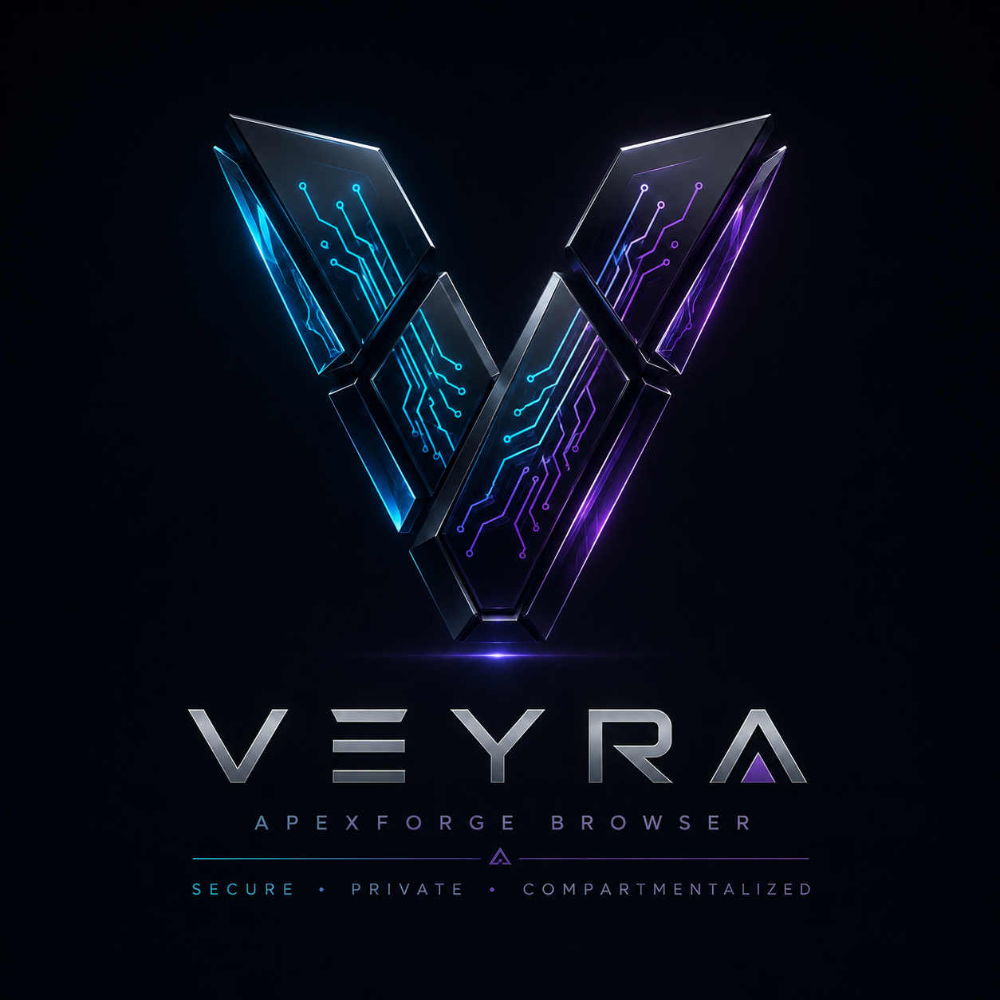

<p align="center">
  
</p>

```text
 █████╗ ██████╗ ███████╗██╗  ██╗███████╗ ██████╗ ██████╗  ██████╗ ███████╗
██╔══██╗██╔══██╗██╔════╝╚██╗██╔╝██╔════╝██╔═══██╗██╔══██╗██╔════╝ ██╔════╝
███████║██████╔╝█████╗   ╚███╔╝ █████╗  ██║   ██║██████╔╝██║  ███╗█████╗
██╔══██║██╔═══╝ ██╔══╝   ██╔██╗ ██╔══╝  ██║   ██║██╔══██╗██║   ██║██╔══╝
██║  ██║██║     ███████╗██╔╝ ██╗██║     ╚██████╔╝██║  ██║╚██████╔╝███████╗
╚═╝  ╚═╝╚═╝     ╚══════╝╚═╝  ╚═╝╚═╝      ╚═════╝ ╚═╝  ╚═╝ ╚═════╝ ╚══════╝

██╗   ██╗███████╗██╗   ██╗██████╗  █████╗ 
██║   ██║██╔════╝╚██╗ ██╔╝██╔══██╗██╔══██╗
██║   ██║█████╗   ╚████╔╝ ██████╔╝███████║
╚██╗ ██╔╝██╔══╝    ╚██╔╝  ██╔══██╗██╔══██║
 ╚████╔╝ ███████╗   ██║   ██║  ██║██║  ██║
  ╚═══╝  ╚══════╝   ╚═╝   ╚═╝  ╚═╝╚═╝  ╚═╝

Compartmentalized · Secure · Persona-Driven · Cyber OS
```

<p align="center">
  
  
  
  
  
  
</p>

**ApexForge Veyra** is more than just a browser—it's a next-generation **Cyber Operating System** designed to bridge the gap between traditional browsing and high-stakes operational workflows. Built on a low-level native foundation of **C++** and **Rust**, Veyra provides deep, policy-driven compartmentalization that treats every browsing session as a distinct, isolated operational entity.

### 🛡️ Core Pillars of Veyra:

*   **Digital Personas**: Go beyond profiles. Veyra offers true isolation with dedicated partitions for *Work, Research, Red Team, Banking, and Disposable* sessions. Each persona maintains its own independent storage, cookie jars, and fingerprint policy.
*   **Sentinel Guard**: A proactive security layer that monitors your privacy posture, flags phishing indicators, and enforces strict permission brokering.
*   **GhostNet**: Advanced, route-aware networking with native support for *VPN, Tor, and residential proxy chaining*—visualized and controlled at the persona level.
*   **BlackVault**: A secure, quarantined staging area for intercepted downloads, providing metadata analysis and risk scoring before files ever touch your host system.
*   **ForgeAI**: A local-first AI orchestrator that assists with page summarization, script explanation, and OSINT collection without leaking your data to the cloud.

Veyra is engineered for security researchers, OSINT analysts, and developers who require a professional-grade command center for their digital identity and cyber operations.

# ApexForge Veyra

**Not Just A Browser - A Cyber Operating System.**

ApexForge Veyra is evolving along two tracks:

- a current Electron prototype for product exploration
- a new core-foundation track for a real browser architecture

This repository is not yet a full native browser implementation, but it now includes the first foundation scaffolding for that direction.

Full written product requirements and stack decisions are tracked in [docs/VEYRA_PRODUCT_SPEC.md](/mnt/zboth/ApexForge_Veyra/docs/VEYRA_PRODUCT_SPEC.md).
The core-first implementation plan is tracked in [docs/VEYRA_CORE_FOUNDATION_PLAN.md](/mnt/zboth/ApexForge_Veyra/docs/VEYRA_CORE_FOUNDATION_PLAN.md).

## Repository Tracks

### 1. Prototype Track

The existing Electron app under [`src/`](/mnt/zboth/ApexForge_Veyra/src) remains useful for:

- UI exploration
- workflow demos
- persona and dashboard mockups
- product concept validation

### 2. Core Foundation Track

The new low-level foundation work starts under:

- [`core/`](/mnt/zboth/ApexForge_Veyra/core)
- [`schemas/`](/mnt/zboth/ApexForge_Veyra/schemas)

This track is where the real browser architecture begins:

- C++ browser shell scaffold
- formal persona, route, and security-mode schemas
- build-system setup for native work

## Product Direction

### 1. Digital Personas
- Real Identity, Anonymous, Work, Research, Banking, Red Team, and Disposable sessions
- Isolated cookie and storage partitions per persona
- Ghost-style ephemeral sessions for throwaway browsing

### 2. Security Modes
- Casual for everyday browsing
- Hardened for stricter privacy controls
- Ghost for in-memory sessions
- Red Team for isolated routing and higher scrutiny

### 3. Built-in Modules
- `Sentinel Guard`: privacy and browsing posture
- `GhostNet`: route and tunnel visualization
- `ForgeAI`: AI assistant workspace
- `BlackVault`: quarantined artifact destination
- `ShadowTabs`: compartment-focused persona model
- `SpecterScan`: download inspection concept
- `NebulaSync`: future encrypted sync concept

### 4. AI + Workspace
- Built-in assistant panel for page analysis and workflow guidance
- OSINT workspace for domain lookups and metadata-oriented flows
- A stepping stone toward autonomous browsing and agent orchestration

## Architecture

- Current prototype: Electron + HTML + CSS + JavaScript
- Future target:
  - UI and control plane: TypeScript + React
  - Security, routing, and artifact handling services: Rust
  - AI and automation: Python plus TypeScript integrations
  - Browser core: native C++ shell with a dedicated Veyra engine-integration layer

## Realistic Language Split

- `TypeScript + React`: dashboard UI, settings, command palette, AI workspace, persona management
- `JavaScript`: minimal prototype glue in the current Electron demo
- `Rust`: download scanning, routing control, isolation policy engine, secure storage helpers
- `Python`: local AI orchestration, OSINT tools, report generation, YARA- and model-facing workflows
- `C++`: browser shell, engine integration, sandbox hooks, WebRTC/WebGPU policy, fingerprint surfaces
- `Go`: enterprise sync, SOC connectors, fleet management, service APIs
- `C`: only for low-level helpers where platform APIs or legacy libraries require it

Using both React and Angular in the same desktop client is not recommended here. React is the better fit for this product direction because the UI will behave more like a command center than a traditional CRUD dashboard.

## Getting Started

### Prototype Prerequisites
- Node.js 18+
- npm 9+

### Run Prototype

```bash
npm install
npm start
```

### Core Foundation Prerequisites

- CMake 3.20+
- A C++17 compiler

### Build Core Scaffold

```bash
cmake -S . -B build/core
cmake --build build/core
./build/core/veyra_shell
```

## Current Prototype Scope

This version demonstrates:
- branded browser shell
- persona switching
- security mode switching
- AI panel mock interactions
- OSINT workspace mock outputs
- routing and guard dashboards

It does not yet implement:
- real proxy or Tor routing
- microVM tab isolation
- full anti-fingerprinting
- malware scanning
- local LLM orchestration

## Current Core Foundation Scope

The native foundation currently includes:

- repository split toward a core-first architecture
- formal JSON schemas for personas, routes, and security modes
- schema-backed startup validation for seed foundation data
- an initial C++ runtime policy engine and permission-broker layer
- a buildable C++ shell bootstrap
- a place to grow toward native engine integration

It does not yet include:

- engine backend integration
- real tab rendering
- native routing services
- vault and scanning services
- policy enforcement inside a real browser shell

## License

ISC
